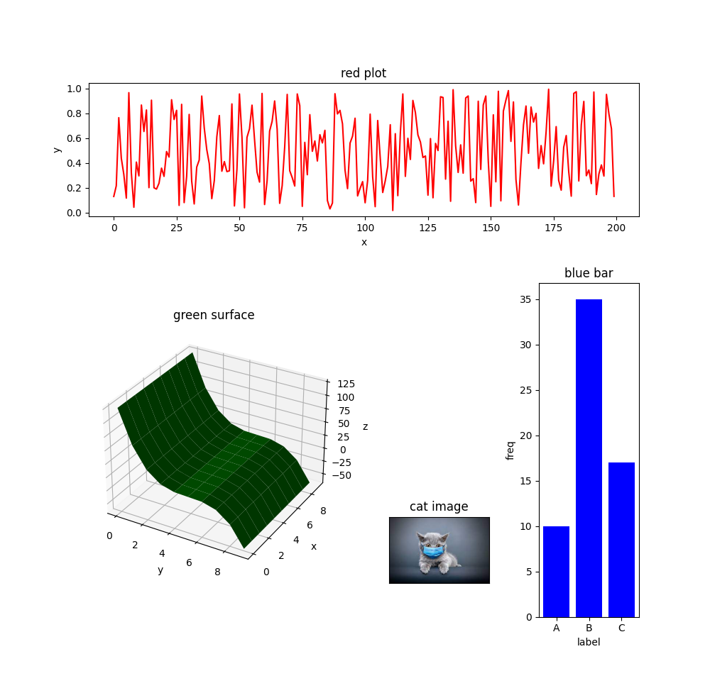

# Matplotlib Dashboard Package

This package creates a simple user interface for creating subfigures when working with matplotlib.

* Draw a map of the subfigures next to each other in the form of a list of lists and pass it on when creating the dashboard.
* Using the getitem syntax (`dashboard[item]`), get the subfigure you want and draw a plot on it.
* If you want to empty part of the map, use the `None` keyword in the map.
* If you want to create a 3D subfigure, use the `3D` postfix at the end of its name on the map.
* To change the horizontal or vertical spacing between subfigures, set the `wspace` and `hspace` parameters when creating the dashboard.
* Determine the overall size of the dashboard using the `plt.figure(figsize=(x,y)` command before building the dashboard.
* This dashboard creates an interface between the user and the `matplotlib` package. Therefore, any customization on `matplotlib` also applies to this dashboard.
* This module itself uses the `matplotlib.gridspec` package. Therefore, any customization on `matplotlib.gridspec` can also be applied to this dashboard. Set the required parameters in the dashboard constructor.

```python
import matplotlib.pyplot as plt
from matplotlib_dashboard import MatplotlibDashboard
import numpy as np
from PIL import Image

plt.figure(figsize=(10,10))

dashboard = MatplotlibDashboard([
    ['red','red','red','red'],
    ['g3D','g3D',None,'blue'],
    ['g3D','g3D','im','blue'],
], wspace=0.5, hspace=0.5)

dashboard['red'].plot(np.random.rand(200), color='red')
dashboard['red'].set_ylabel('y')
dashboard['red'].set_xlabel('x')
dashboard['red'].set_title('red plot')

dashboard['blue'].bar(['A','B','C'], [10,35,17], color='blue')
dashboard['blue'].set_ylabel('freq')
dashboard['blue'].set_xlabel('label')
dashboard['blue'].set_title('blue bar')

dashboard['im'].imshow(Image.open('test1.jpeg'))
dashboard['im'].get_xaxis().set_ticks([])
dashboard['im'].get_yaxis().set_ticks([])
dashboard['im'].set_title('cat image')

z = ((5-np.arange(100)%10)**3).reshape(10,10)
x, y = np.meshgrid(np.arange(z.shape[0]), np.arange(z.shape[1]))
dashboard['g3D'].plot_surface(x, y, z, color='green')
dashboard['g3D'].set_ylabel('x')
dashboard['g3D'].set_xlabel('y')
dashboard['g3D'].set_zlabel('z')
dashboard['g3D'].set_title('green surface')

plt.show()
```


## Installation
Package is avalable on [PyPI](https://test.pypi.org/project/matplotlib-dashboard/).